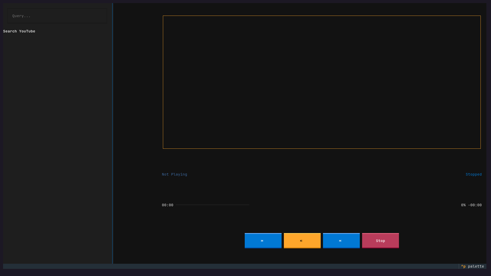
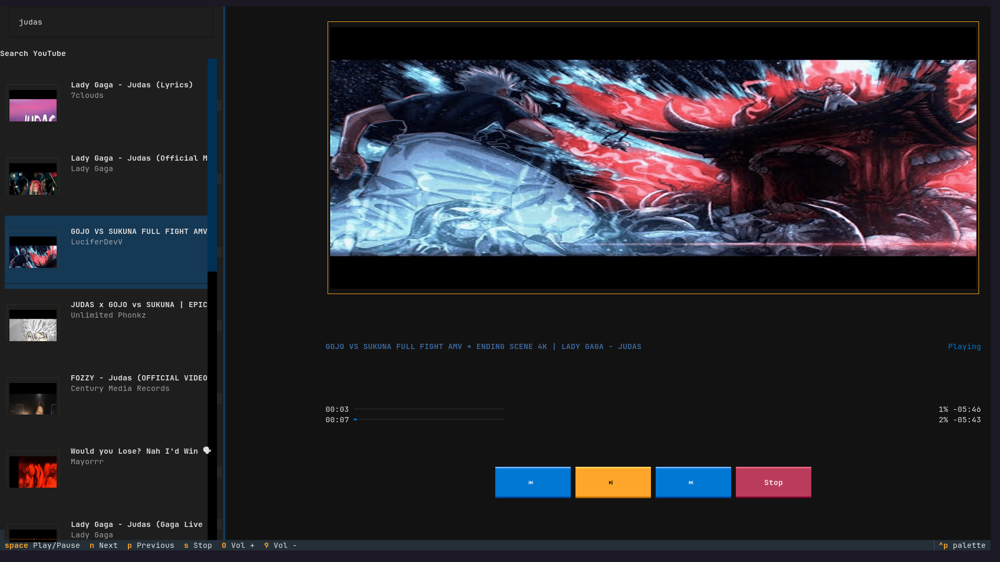

# YTUI Music

A terminal-based YouTube audio player that's lightweight and keyboard-first. Search YouTube, browse results with inline thumbnails, and play audio with familiar controls.





## Features

- YouTube search with inline thumbnails (cached per session)
- Background workers for non-blocking operations
- Compact UI showing more results per screen
- Playback controls: play/pause, stop, next/prev, 10s seek, volume
- Progress bar with elapsed/remaining time
- Vim-style navigation keys

## Requirements

- Python 3.11+
- `mpv` installed on your system

## Installation

```bash
pip install -r requirements.txt
```

## Usage

```bash
python yt.py
```

### Keybindings

| Key | Action |
|-----|--------|
| `Tab` | Cycle focus (search ↔ results) |
| `Enter` | Play selected result |
| `Space` | Toggle play/pause |
| `←` / `→` | Seek -10s / +10s |
| `n` / `p` | Next / Previous (auto-play) |
| `s` | Stop |
| `0` / `9` | Volume up / down |
| `Ctrl+C` | Quit |
| `↑` / `↓` | Navigate results |

#### Vim-style Navigation (when results list focused)

| Key | Action |
|-----|--------|
| `j` | Move down |
| `k` | Move up |
| `g` | Jump to top |
| `G` | Jump to bottom |

### Tips

- Use `Tab` to switch between search box and results list
- Vim keys (`j`/`k`/`g`/`G`) only navigate, they don't autoplay
- Use `n`/`p` to navigate + autoplay, or `Enter` to play selection
- Network errors show as toasts; the app keeps running
- Thumbnails are cached per video ID per session
- Logs written to `player_debug.log` (ERROR level)

## Project Structure

```
ytui_music/
├── yt.py                 # Main entry point
├── player/
│   ├── __init__.py
│   └── audio.py          # AudioPlayer (MPV wrapper)
├── widgets/
│   ├── __init__.py
│   ├── search_result.py  # SearchResultItem widget
│   ├── controls.py       # PlayerControls widget
│   └── thumbnail.py      # ThumbnailWidget
├── utils/
│   ├── __init__.py
│   ├── search.py         # YouTube search
│   └── thumbnails.py     # Thumbnail fetching/caching
└── css/
    └── styles.tcss       # Application styles
```

## License

GPL-3.0
